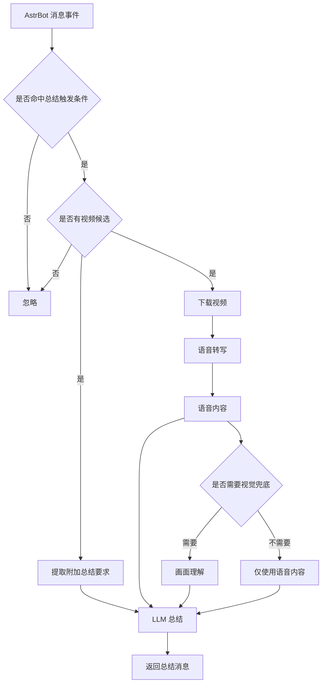

# AI 视频总结

_✨ 自动转写视频内容并生成总结 ✨_

---

## 🚀 快速开始

1. 安装后在 AstrBot WebUI 的“大模型提供商”中选择 AstrBot 内置提供商，或选择插件自定义提供商并填写自定义 AI 接口
2. 等待依赖和语音模型下载完成（AstrBot 日志可查看进度）
3. 在消息平台引用视频消息并发送关键词即可触发总结

---

## 📝 注意事项

1. 首次启动会自动准备语音转写环境和模型，耗时取决于网络环境，可在 AstrBot 日志中查看进度。
2. 使用时请引用包含视频的消息，再发送总结关键词；关键词之外的文字会作为本次总结要求。
3. 默认使用 AstrBot 已配置的 AI，也可以在插件配置中切换为插件独立 AI 接口。
4. 当视频语音信息不足时，插件会尝试结合画面补充；效果取决于所选 AI 是否支持图片理解。
5. 管理员可在私聊中发送 `aiping` 测试 AI 连通性。
6. 提示词通常无需修改；只有想调整总结口吻、结构或视觉理解方式时再自定义，留空会使用内置默认模板。

---

## 🤖 支持的模型

| 类型 | 官方 Base URL | 说明 |
| --- | --- | --- |
| 自定义 OpenAI 兼容 | 自定义填写 | 兼容 OpenAI Chat Completions 接口 |
| OpenAI | `https://api.openai.com/v1` | OpenAI 官方接口 |
| Azure OpenAI | `https://{resource-name}.openai.azure.com/` | 资源专属地址，需配合 `api-version` |
| Anthropic Claude | `https://api.anthropic.com` | Claude 官方接口 |
| Google Gemini | `https://generativelanguage.googleapis.com/v1beta` | Gemini 官方接口 |
| xAI Grok | `https://api.x.ai/v1` | Grok 官方接口 |
| Ollama | `http://localhost:11434` | 本地部署 |
| DeepSeek | `https://api.deepseek.com/v1` | OpenAI 兼容接口 |
| Moonshot / Kimi | `https://api.moonshot.cn/v1` | OpenAI 兼容接口 |
| 阿里云百炼 / 通义千问 | `https://dashscope.aliyuncs.com/compatible-mode/v1` | OpenAI 兼容接口 |
| 智谱 AI / GLM | `https://open.bigmodel.cn/api/paas/v4` | 官方接口 |
| 火山引擎方舟 / 豆包 | `https://ark.cn-beijing.volces.com/api/v3` | 官方接口 |
| 腾讯混元 | `https://api.hunyuan.cloud.tencent.com/v1` | 官方接口 |
| 百度千帆 / 文心 | `https://qianfan.baidubce.com/v2` | 官方接口 |
| Mistral AI | `https://api.mistral.ai/v1` | 官方接口 |
| Groq | `https://api.groq.com/openai/v1` | OpenAI 兼容接口 |
| OpenRouter | `https://openrouter.ai/api/v1` | OpenAI 兼容接口 |
| SiliconFlow | `https://api.siliconflow.cn/v1` | OpenAI 兼容接口 |
| Together AI | `https://api.together.xyz/v1` | OpenAI 兼容接口 |
| Fireworks AI | `https://api.fireworks.ai/inference/v1` | OpenAI 兼容接口 |
| DeepInfra | `https://api.deepinfra.com/v1/openai` | OpenAI 兼容接口 |

---

## 🔄 工作流

