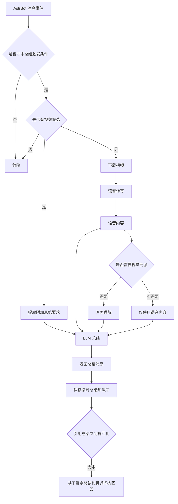

<div align="center">


# AI 视频总结

_✨ 自动转写视频内容并生成总结 ✨_

[](https://www.gnu.org/licenses/agpl-3.0.html)
[](https://www.python.org/)
[](https://github.com/AstrBotDevs/AstrBot)
[](https://github.com/drdon1234/astrbot_plugin_ai_summary)
[](https://github.com/drdon1234)

</div>

---

## 🚀 快速开始

1. 安装后在 AstrBot WebUI 的“大模型提供商”中选择 AstrBot 内置提供商，或选择插件自定义提供商并填写自定义 AI 接口
2. 等待依赖和语音模型下载完成（AstrBot 日志可查看进度）
3. 在消息平台引用视频消息并发送总结命令即可触发总结

---

## 📝 注意事项

1. 首次启动会自动准备语音转写环境和模型，耗时取决于网络环境，可在 AstrBot 日志中查看进度。
2. 使用时请引用包含视频的消息，再发送总结命令；命令之外的文字会作为本次总结要求。
3. 默认使用 AstrBot 已配置的 AI，也可以在插件配置中切换为插件独立 AI 接口。
4. 当视频语音信息不足时，插件会尝试结合画面补充；效果取决于所选 AI 是否支持图片理解。
5. 可在“输出控制”中分别选择总结和问答的内容格式（纯文本 / Markdown）与发送格式（文本 / 图片），并调整图片字体大小；图片模式使用插件自定义渲染器生成温和浅色卡片图片。
6. 管理员可在私聊中发送 `aiping` 测试 AI 连通性。
7. 总结、视觉判断和视觉分析均使用内置提示词，WebUI 不再暴露自定义提示词入口。
8. 总结模式由触发命令决定：`总结一下` / `总结视频` 为自动，`简略总结` / `简单总结` 为简略，`专业总结` / `详细总结` 为专业。
9. 首次总结结果会保存为同一私聊或群聊内的临时问答知识库；私聊和群聊都通过引用插件的总结或问答回复并输入问题来触发对应视频问答。每个视频会保留最近几轮问答作为短对话记忆。
10. 问答知识库默认按最后检索时间保留 30 分钟，超过后自动清理；可在 `qa.record_ttl_minutes` 中调整，设为 `0` 可关闭自动清理。

图片发送模式使用 Pillow 直接把总结或问答内容绘制为温和浅色卡片图片，并固定加载插件本地 `resource/font/NotoSansCJKsc-Regular.otf` 与 `resource/font/NotoSansCJKsc-Bold.otf` 字体文件，不依赖浏览器截图环境或系统字体。正文基础字号可通过 `output.image_font_size` 调整，标题和小标题会按比例自动放大。

---

## 💬 总结问答

完成一次视频总结后，插件会把最终总结文本保存为临时知识库。私聊和群聊都通过引用插件的总结或问答回复来提问，输入的正文会直接作为问题：

```text
这个视频的核心结论是什么？
它提到了哪些风险？
有哪些关键人物或机构？
```

发送 `结束` 或 `退出` 会结束本轮问答，但不会删除已保存的总结知识库或引用绑定；发送 `清理` 或 `清空` 会清除当前私聊或群聊 scope 下的问答知识库。这两组命令可通过 `qa.exit_commands` 和 `qa.clear_commands` 调整。每条总结或问答回复都会带有 `问答ID` 标记并绑定对应的总结记录，后续引用哪条 AI 回复，就会自动切到那条视频的问答；总结和问答都可独立配置文本 / 图片发送，图片发送模式会把 `问答ID` 作为同条消息里的文本标记一起发送，便于引用识别。

问答不会重新分析视频；基础总结会作为当前视频上下文补充，最近问答会作为短对话记忆。涉及视频里具体发生了什么时，会优先参考基础总结，没覆盖就说明未覆盖；涉及通用知识、制作方法、工具建议、背景解释时，会正常使用 AI 的通用能力回答。临时知识库保存在 `cache_dir/runtime/qa_records/`，默认 30 分钟未被检索会自动删除，避免长期占用存储；每个视频默认只保留最近 5 轮问答，可通过 `qa.history_turns` 调整，设为 `0` 可关闭短对话记忆。

---

## 🤖 支持的模型

| 类型 | 官方 Base URL | 说明 |
| --- | --- | --- |
| 自定义 OpenAI 兼容 | 自定义填写 | 兼容 OpenAI Chat Completions 接口 |
| OpenAI | `https://api.openai.com/v1` | OpenAI 官方接口 |
| Azure OpenAI | `https://{resource-name}.openai.azure.com/` | 资源专属地址，需配合 `api-version` |
| Anthropic Claude | `https://api.anthropic.com` | Claude 官方接口 |
| Google Gemini | `https://generativelanguage.googleapis.com/v1beta` | Gemini 官方接口 |
| xAI Grok | `https://api.x.ai/v1` | Grok 官方接口 |
| Ollama | `http://localhost:11434` | 本地部署 |
| DeepSeek | `https://api.deepseek.com/v1` | OpenAI 兼容接口 |
| Moonshot / Kimi | `https://api.moonshot.cn/v1` | OpenAI 兼容接口 |
| 阿里云百炼 / 通义千问 | `https://dashscope.aliyuncs.com/compatible-mode/v1` | OpenAI 兼容接口 |
| 智谱 AI / GLM | `https://open.bigmodel.cn/api/paas/v4` | 官方接口 |
| 火山引擎方舟 / 豆包 | `https://ark.cn-beijing.volces.com/api/v3` | 官方接口 |
| 腾讯混元 | `https://api.hunyuan.cloud.tencent.com/v1` | 官方接口 |
| 百度千帆 / 文心 | `https://qianfan.baidubce.com/v2` | 官方接口 |
| Mistral AI | `https://api.mistral.ai/v1` | 官方接口 |
| Groq | `https://api.groq.com/openai/v1` | OpenAI 兼容接口 |
| OpenRouter | `https://openrouter.ai/api/v1` | OpenAI 兼容接口 |
| SiliconFlow | `https://api.siliconflow.cn/v1` | OpenAI 兼容接口 |
| Together AI | `https://api.together.xyz/v1` | OpenAI 兼容接口 |
| Fireworks AI | `https://api.fireworks.ai/inference/v1` | OpenAI 兼容接口 |
| DeepInfra | `https://api.deepinfra.com/v1/openai` | OpenAI 兼容接口 |

---

## 🔄 工作流


