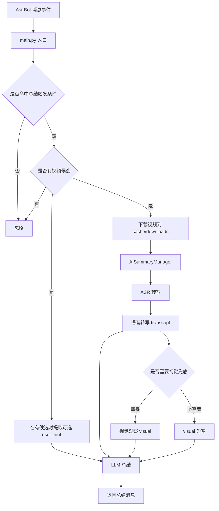
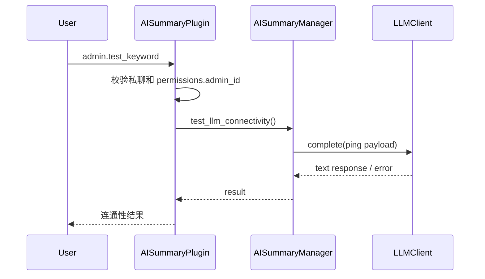

# 视频 AI 总结插件架构文档

本文档描述 `astrbot_plugin_ai_summary` 的当前运行时架构。

## 1. 系统概览

`astrbot_plugin_ai_summary` 是一个 AstrBot 插件，用于从引用消息中提取视频，下载到本地后进行 ASR 转写、可选视觉兜底，再调用 LLM 生成总结。

它有两条主要入口：

1. 普通消息总结流程：基于总结命令触发，要求引用含视频的消息。
2. 管理员连通性测试流程：基于可配置关键词触发，只允许私聊中的 `permissions.admin_id` 对应账号使用。

核心链路如下：



## 2. 模块边界

```text
main.py
core/
  config.py
  output_render.py
  logger.py
  summary/
    __init__.py
    manager.py
    llm_client.py
    llm_provider_defs.py
    prompts.py
    asr_runtime.py
    asr_worker.py
```

### `main.py`

插件入口层，负责：

- 注册 AstrBot 插件
- 监听消息事件
- 判断权限和触发条件
- 提取引用消息里的视频源
- 下载视频文件
- 清理下载产物
- 转发到 `AISummaryManager`

### `core/config.py`

配置解析层，负责：

- 把 AstrBot WebUI 配置转换成 `AISummaryConfig`
- 解析触发器、LLM、权限、输出控制和管理员调试配置
- 生成插件运行所需的默认缓存路径

### `core/output_render.py`

输出渲染层，负责：

- 使用 Pillow 将纯文本或常见 Markdown 结构绘制为温和浅色单列卡片 PNG
- 固定加载插件本地 `resource/font/arialuni.ttf` 字体文件，避免依赖系统中文字体
- 不依赖 `imgkit`、`wkhtmltoimage` 或 AstrBot 内置截图渲染器

### `core/summary/manager.py`

总结编排层，负责：

- 调度 ASR 准备和模型准备
- 从本地视频提取音频
- 执行本地 ASR 子进程
- 决定是否启用视觉兜底
- 组织 LLM 总结请求，可使用 AstrBot 已配置的 AI 或插件自定义接口
- 提供管理员连通性测试能力

### `core/summary/llm_client.py`

插件自定义 LLM 协议适配层，负责：

- 将通用聊天 payload 转成不同厂商的 HTTP 请求
- 支持 OpenAI、Azure OpenAI、Anthropic、Gemini、Ollama 等协议
- 从响应中提取最终文本

### `core/summary/asr_runtime.py`

运行时准备层，负责：

- 检查当前 Python 环境是否已安装 ASR 依赖
- 必要时自动安装 `requirements-asr.txt`
- 管理 ASR 模型下载状态和持久化状态

### `core/summary/asr_worker.py`

ASR 子进程执行层，负责：

- 加载 FunASR ASR/VAD 模型并执行音频转写
- 保留可读的 `plain_text`
- 在模型返回词级 timestamp 时生成约 25 秒一段的 `segments`
- 将带 `[mm:ss-mm:ss]` 的分段文本写入 `text`，供专业 Markdown 总结提取时间点

### `core/summary/prompts.py`

提示词层，负责：

- 提供默认总结系统提示词
- 提供简略 / 专业两种总结模板；自动模式在运行时根据信息密度路由到其中一种
- 提供视觉兜底判断和视觉分析提示词
- 作为插件唯一内置提示词来源，WebUI 不再暴露自定义提示词入口

## 3. 请求流

### 3.1 普通总结流程

1. `main.py` 接收消息事件。
2. 判断是否命中自动 / 简略 / 专业任一总结命令，并记录本次请求的总结模式。
3. 用 `permissions` 做访问控制。
4. 从引用消息中提取视频源，并去重；没有视频候选时流程结束。
5. 确认存在视频候选后，如果消息文本中除总结命令外还有内容，会提取为可选的 `user_hint`。
6. 下载视频到 `cache_dir/downloads/`。
7. 把候选元数据交给 `AISummaryManager`。
8. `AISummaryManager` 先转写，再按需要做视觉兜底。
9. 总结 prompt 会携带可选 `user_hint`、转写内容和视觉内容；当 ASR 返回 timestamp 时，转写内容会带时间段，方便最终专业总结保留关键时间点。
10. 生成总结并回发给消息平台。

### 3.2 管理员连通性测试流程

1. 消息内容等于 `admin.test_keyword` 时才进入测试流程，默认值为 `aiping`。
2. 再校验消息是否来自私聊，并确认发送者是否等于 `permissions.admin_id`。
3. 调用 `AISummaryManager.test_llm_connectivity()`。
4. 发送轻量 `ping` 请求到当前 LLM 配置。
5. 将成功或失败结果回发给管理员。



## 4. 配置结构

配置由 `parse_config()` 统一解析，主要分为以下几组：

### `llm`

- `provider_source`：大模型提供商来源，下拉选择 AstrBot 内置提供商或插件自定义提供商
- `astrbot_provider.provider_id`：选择 AstrBot 中的 LLM Provider；留空时尝试使用当前会话 AI
- `custom_provider.provider`：插件自定义接口的厂商类型
- `custom_provider.base_url`：插件自定义接口地址
- `custom_provider.api_key`：插件自定义接口密钥
- `custom_provider.model`：插件自定义接口模型名
- `custom_provider.api_version`：插件自定义接口版本参数

### `permissions`

- `admin_id`：管理员账号
- `whitelist` / `blacklist`：群组和用户访问控制

### `trigger`

- `reply_keyword_trigger`：是否开启“引用 + 命令”触发
- `auto_keywords`：自动总结命令列表，默认 `总结一下` / `总结视频`
- `brief_keywords`：简略总结命令列表，默认 `简略总结` / `简单总结`
- `professional_keywords`：专业总结命令列表，默认 `专业总结` / `详细总结`

### `基础质量`

- `summary.max_completion_tokens`：总结最大输出长度
- `summary.temperature`：总结随机性
- `summary.max_transcript_chars`：进入总结提示词的转写文本上限
- `vision.max_frames`：每个视频最大抽帧数，`0` 表示关闭视觉帧分析
- `vision.frame_size`：视觉帧宽度，`原始尺寸` 表示不做本地缩放
- `vision.image_detail`：发送给视觉模型的图片细节模式
- `vision.batch_size`：每批视觉请求包含的图片数量

### `高级质量`

- `summary.max_concurrent`：总结并发上限，同时约束跨消息总结和单条消息内多视频总结
- `summary.request_timeout_seconds`：总结请求超时时间
- `vision.max_concurrent`：视觉识别批次并发上限
- `vision.jpeg_quality`：ffmpeg 输出 JPEG 的压缩质量
- `vision.max_chars`：视觉观察文本进入最终总结前的长度上限
- `vision.request_timeout_seconds`：视觉识别请求超时时间
- `asr.device`：本地 ASR 推理设备
- `asr.max_concurrent`：语音转写子进程并发上限
- `asr.batch_size_s`：每批转写时长
- `asr.sample_rate`：音频采样率
- `asr.asr_timeout_seconds`：音频提取和转写超时时间

### 内置提示词

总结、视觉兜底判断和视觉分析提示词由 `core/summary/prompts.py` 统一提供，不再通过 WebUI 暴露自定义提示词入口。

内置模板变量：

- `{user_hint}`：用户在触发命令之外附加的提示
- `{transcript}`：语音转写文本
- `{visual}`：视觉兜底判定和视觉观察
- `{frame_notes}`：视觉分析抽样帧说明，仅视觉分析提示词使用

### `output`

- `status_message`：是否发送处理中提示
- `summary_format`：最终总结内容格式，可选纯文本或 Markdown
- `send_format`：最终回复发送格式，可选文本或图片；图片模式通过 Pillow 和插件本地字体生成温和浅色单列卡片图片
- `show_error`：是否回显失败原因
- `enable_summary_repair`：是否在最终回复前启用格式修复，默认清理原始转写泄漏、非标准核对标记和不一致的不确定性注释

### `admin`

- `debug_mode`：调试日志
- `test_keyword`：管理员连通性测试关键词，默认 `aiping`；仅 `permissions.admin_id` 对应账号在私聊中发送时生效，不触发视频总结

## 5. 运行时状态与存储

插件默认把运行数据放在 AstrBot 的插件数据目录下：

- `cache_dir`：插件根缓存目录
- `cache_dir/runtime/`：运行时状态目录
- `cache_dir/downloads/`：视频下载目录
- `cache_dir/runtime/images/`：图片发送模式生成的临时总结图片目录
- `cache_dir/runtime/summary_tmp/`：临时音频、转写和视觉分析目录

运行时状态主要包括：

- ASR 依赖检查状态
- ASR 模型下载状态
- 临时安装锁
- 失败原因记录

清理策略：

- 下载文件只在 `downloads/` 内清理
- 临时目录由 `TemporaryDirectory` 自动回收
- 运行状态文件用于重载后恢复进度

## 6. 外部依赖

### 运行时依赖

- AstrBot API
- `aiohttp`
- `ffmpeg`
- Pillow：仅图片发送模式需要；直接执行文本转图片，不依赖浏览器截图环境

### ASR 相关依赖

- `funasr`
- `modelscope`
- `torch`
- `torchaudio`

### LLM 相关依赖

当 `llm.provider_source` 选择 AstrBot 内置提供商时，插件通过 AstrBot `Context.llm_generate()` 调用 `llm.astrbot_provider.provider_id` 指定的 Provider；未指定时尝试使用当前会话 Provider。

当 `llm.provider_source` 选择插件自定义提供商时，由 `LLMClient` 按 `llm.custom_provider` 中的厂商配置构造请求，当前支持的协议分支包括：

- OpenAI 兼容
- Azure OpenAI
- Anthropic
- Gemini
- Ollama

## 7. 失败边界

系统把失败尽量限制在局部步骤中，而不是让整条链路黑掉：

- 配置缺失时，LLM 连接测试和总结请求会直接报缺项
- ASR 依赖未就绪时，会先进入后台准备
- 本地视频下载失败时，单个候选会标记错误，不影响其他候选
- 转写为空时，可继续走视觉兜底
- LLM 请求失败时，会把错误写回结果消息
